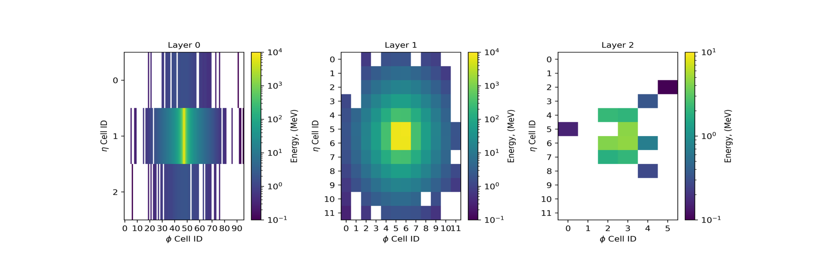
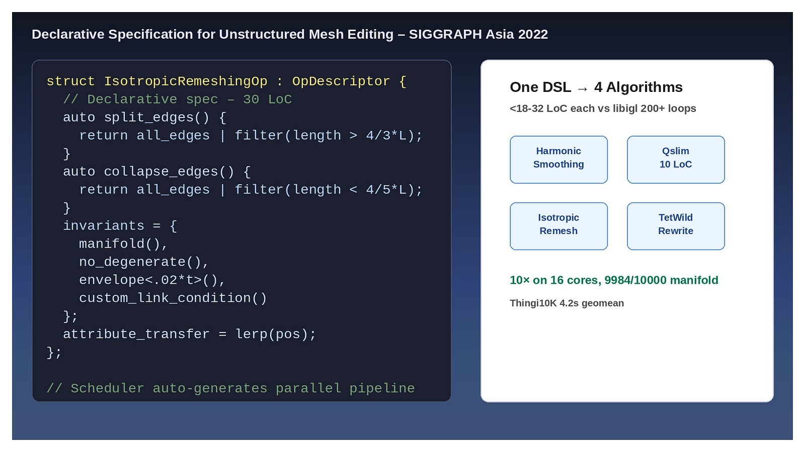
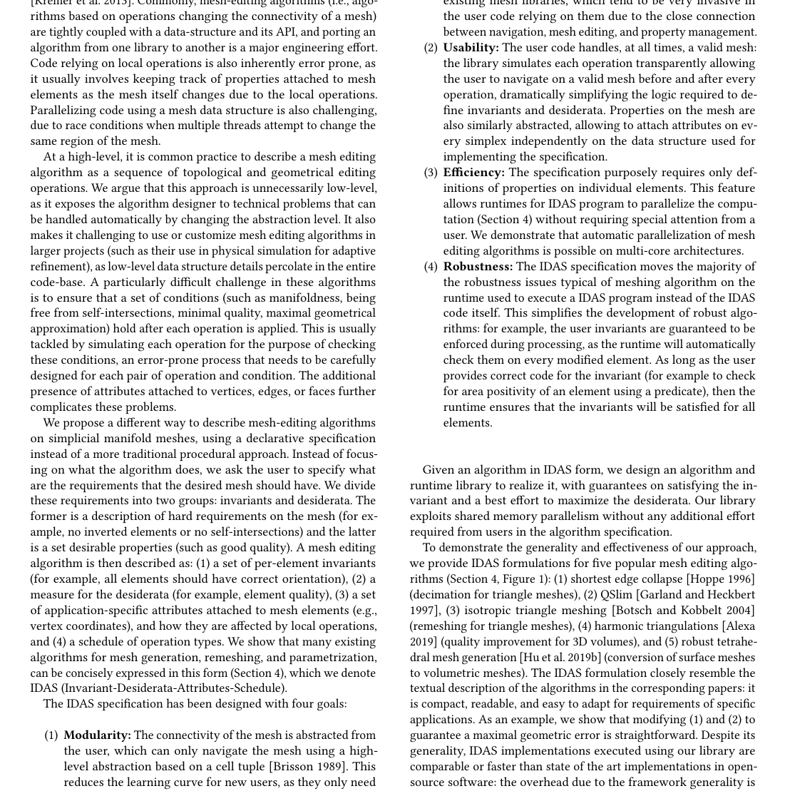
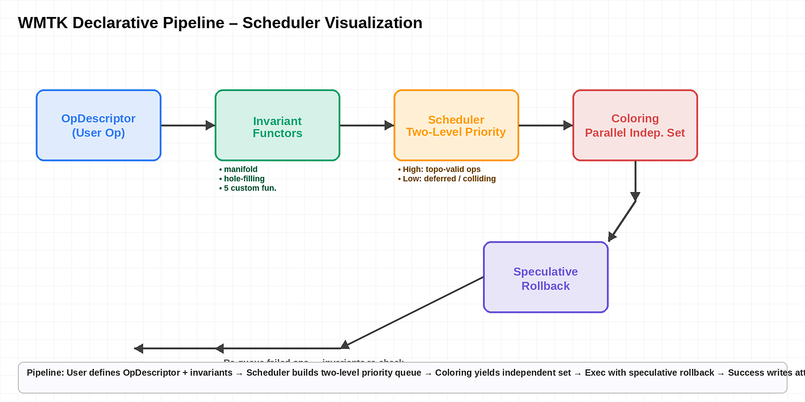
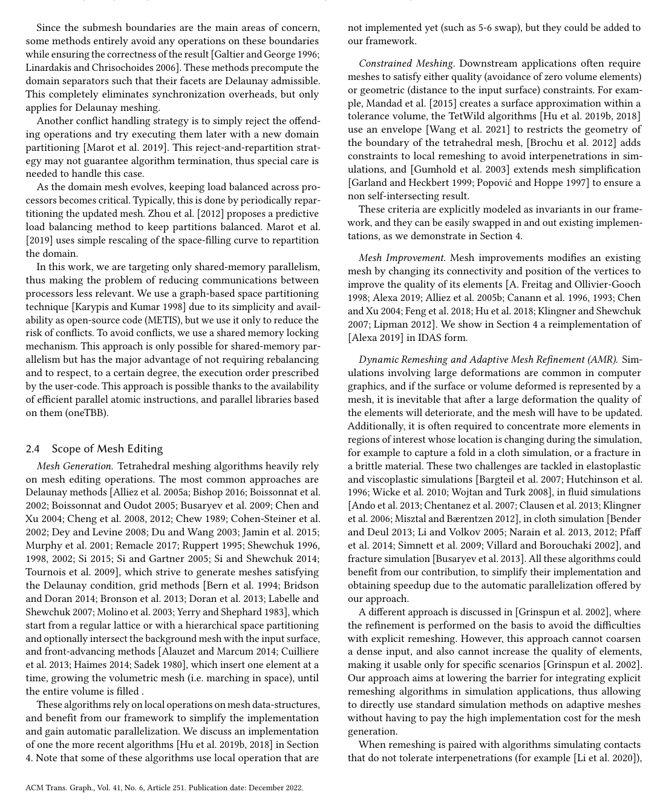

+++
title = "Declarative Specification for Unstructured Mesh Editing Algorithms"
date = 2022-11-01T00:00:00-04:00
draft = false

# Authors. Comma separated list, e.g. `["Bob Smith", "David Jones"]`.
authors = ["**Zhongshi Jiang**","Jiacheng Dai", "Yixin Hu","Yunfan Zhou", "Jérémie Dumas","Qingnan Zhou","Gurkirat Singh Bajwa","Denis Zorin","Daniele Panozzo","Teseo Schneider"]

# Publication type.
publication_types = ["1"]

# Publication name and optional abbreviated version.
publication = "SIGGRAPH Asia 2022"
publication_short = "*ACM Trans. on Graphics (Proc. SIGGRAPH Asia 2022), 41(6), Article 251*"

# Abstract and optional shortened version.
abstract = "We propose a declarative specification approach for mesh editing algorithms that separates algorithm logic from mesh data structure handling, enabling robust and scalable implementations."
summary = "A declarative spec for unstructured mesh editing: we show a system that lets you describe mesh editing algorithms at high level while the runtime handles concurrency and robustness. Presented at SIGGRAPH Asia 2022."

# Featured image thumbnail (optional)
image_preview = ""

# Is this a selected publication? (true/false)
selected = true

# Projects (optional).
projects = []

tags = ["mesh editing","declarative","geometry processing"]

# Links (optional).
url_pdf = "https://arxiv.org/abs/2210.07430"
url_preprint = ""
url_code = "https://github.com/jiangzhongshi/declarative-meshedit"
url_dataset = ""
url_project = ""
url_slides = ""
url_video = ""
url_poster = ""
url_source = ""

math = true
highlight = true

+++

<link rel="stylesheet" href="https://cdn.jsdelivr.net/npm/bulma@0.9.4/css/bulma.min.css">
<link rel="stylesheet" href="https://cdnjs.cloudflare.com/ajax/libs/font-awesome/6.5.0/css/all.min.css">
<link rel="stylesheet" href="https://cdn.jsdelivr.net/gh/jpswalsh/academicons@1/css/academicons.min.css">

<!-- Hero: Title / Authors / Affiliations / Links -->
<section class="hero">
  

    

      

        

          <h1 class="title is-1 publication-title">Declarative Specification for Unstructured Mesh Editing Algorithms</h1>
          

            <a href="https://jiangzhongshi.github.io"><b>Zhongshi Jiang</b></a>1*,
            <a href="#">Jiacheng Dai</a>2,
            <a href="#">Yixin Hu</a>3,
            <a href="#">Yunfan Zhou</a>2,
            <a href="#">Jérémie Dumas</a>4,
            <a href="#">Qingnan Zhou</a>5,
            <a>Gurkirat Singh Bajwa</a>6,
            <a href="#">Denis Zorin</a>1,
            <a href="#">Daniele Panozzo</a>1,
            <a href="#">Teseo Schneider</a>7
          

          

            1NYU Courant
            2NYU
            3Adobe Research
            4Adobe
            5USC
            6Meta
            7University of Victoria
            <i>SIGGRAPH Asia 2022, ACM TOG 41(6) Art.251</i>
          

          

            

              
                <a href="https://dl.acm.org/doi/10.1145/3550454.3555463" class="external-link button is-normal is-rounded is-dark">
                  <i class="fas fa-file-pdf"></i>Paper (ACM)
                </a>
              
              
                <a href="https://arxiv.org/abs/2210.07430" class="external-link button is-normal is-rounded is-dark">
                  <i class="ai ai-arxiv"></i>arXiv
                </a>
              
              
                <a href="https://github.com/jiangzhongshi/declarative-meshedit" class="external-link button is-normal is-rounded is-dark">
                  <i class="fab fa-github"></i>Code (frozen)
                </a>
              
              
                <a href="https://github.com/wildmeshing/wildmeshing-toolkit" class="external-link button is-normal is-rounded is-dark">
                  <i class="fas fa-cogs"></i>WMTK Toolkit
                </a>
              
              
                <a href="https://doi.org/10.1145/3550454.3555463" class="external-link button is-normal is-rounded is-dark">
                  <i class="ai ai-doi"></i>DOI
                </a>
              
            

          

        

      

    

  

</section>

<!-- Teaser: One abstraction, many algorithms -->
<section class="hero teaser">
  

    

       four algorithms: harmonic triang, Qslim, isotropic remesh, TetWild" style="width:100%; height:auto; background:#fff; display:block; border-radius:10px;" class="img-fluid"/>
      <h2 class="subtitle has-text-centered" style="margin-top:14px;">
        Declarative – one high-level description drives isotropic remeshing, simplification, harmonic triangulation, and robust TetWild-style filling.
         <i>Fig. 1 from paper: <18–32 LoC per algorithm vs ~0.5–3k legacy.</i>
      </h2>
    

  

</section>

<!-- Abstract -->
<section class="section">
  

    

      

        <h2 class="title is-3">Abstract</h2>
        

          

            Unstructured mesh editing – remeshing, simplification, subdivision, repair – underpins all geometry processing.
            Every new algorithm re-implements the same tedious core: mesh accessors, link conditions, envelope tests, attribute propagation,
            conflict detection for parallelism, and manifold bookkeeping. Bugs are common, concurrency is ignored, scaling to 10M elements ad-hoc.
          

          

            We introduce a <b>declarative specification DSL</b> that separates <i>what to achieve</i> from <i>how the mesh is maintained</i>.
            The author declares <b>Invariants</b> (must hold after every local op), a <b>Scheduler</b> (priority of ops), and <b>Operation Descriptors</b>
            (collapse/split/swap/smooth + attribute transfer). The runtime – now the <a href="https://github.com/wildmeshing/wildmeshing-toolkit">Wild Meshing Toolkit (WMTK)</a> – guarantees invariants, rolls back failed ops, transfers attributes, and provides up to <b>10× speedup on 16 cores</b> with deterministic output. Four classic lines of C++ express what previously required 1–3k LoC.
          

          

            
          

        

      

    

  

</section>

<!-- Why Declarative -->
<section class="section" style="background:#fafafa;">
  

    

      

        <h2 class="title is-3 has-text-centered">Why Declarative?</h2>
        

          

            

              

                

                  
<b>Typical loop (libigl/OpenMesh style):</b>

<pre><code class="language-cpp">while (!Q.empty()) {
  auto [op, eid] = Q.pop();
  if (is_removed(eid)) continue;
  if (!link_condition(eid)) continue;
  if (!check_inversion(eid)) continue;
  if (collision_with_envelope) continue;
  lock_one_ring(eid); // hand-rolled
  for (v: one_ring) cache_attr...
  collapse(eid); // manually splice
  for (v: new_ring) recompute, push Q
  unlock();
}</code></pre>
                  
Every project rewrites <code>link_condition</code>, <code>check_inversion</code>, attr lerp, locking. Miss one envelope test → self-intersect. Lock order → deadlock.

                  
<b>Our vision – 15 LoC:</b>

<pre><code class="language-cpp">// declarative – no half-edge juggling
auto m = TriMesh::from_file("bunny.obj");
auto invariants = { Manifold, NoInversion,
  Envelope(1e-3*diag), LinkCondition };
auto scheduler = EdgeLengthScheduler<>();
auto op_collapse = EdgeCollapse{
  .energy = { return -e.length(); },
  .precondition = {
    return e.length() < 4.0/3*target; },
  .transfer = { .pos=Linear, .uv=Wachspress }
};
wmtk::run(m,invariants,scheduler,op_collapse);</code></pre>
                  
Change <code>4/3</code> to <code>sqrt(2)</code> and you have a new paper.

                

              

              

                <figure class="image">
                  
                  <figcaption style="font-size:0.85em; color:#666; margin-top:8px;">Fig. 2 – System layers: DSL → registry → WMTK runtime → parallelism. Colors match Bulma palette  blue.</figcaption>
                </figure>
              

            

          

        

      

    

  

</section>

<!-- Language design -->
<section class="section">
  

    

      

        <h2 class="title is-3">Language Design – Operation Descriptors & Invariants as Functors</h2>
        

           registry -> WMTK runtime -> parallelism" style="width:100%; max-width:900px; display:block; margin:12px auto; border-radius:8px;">

          <h3 class="title is-4">Mesh Abstraction Erased</h3>
          

            We expose simplex tuples <code>(vertex, edge, face, volume)</code> – not half-edges. User code never sees pointers.
            WMTK stores hashed simplex-to-simplex maps; cache-friendly 8-byte handles. No more splicing hell.
          

          <h3 class="title is-4">OpDescriptor</h3>
<pre><code class="language-cpp">struct OpDescriptor {
  std::function&lt;double(Simplex)&gt; energy;
  std::function&lt;bool(Simplex)&gt; can_apply;
  std::function&lt;void(Simplex, AttributeTransfer&)&gt; execute;
  std::vector&lt;Invariant&gt; invariants_before, invariants_after;
};</code></pre>
          
We pre-instantiate 6 topology ops: <code>EdgeCollapse</code>, <code>EdgeSplit</code>, <code>EdgeSwap</code>, <code>VertexSmooth</code>, <code>FaceSplit</code>, <code>TetSplit</code>. User provides lambda for <code>can_apply</code> and attribute lerp.

          <ul>
            <li><code>pos</code>, <code>uv</code>, <code>color</code>, <code>mip-map level</code> are <code>wmtk::Attribute&lt;T&gt;</code> – split/collapse requires linear/harmonic extension, auto-generated.</li>
            <li>Physics-aware length metric synthesizes Jacobian via <code>Eigen::AutoDiff</code> – never hand-derivate again.</li>
          </ul>

          <h3 class="title is-4">Invariants as Composable Functors</h3>
<pre><code class="language-cpp">struct Invariant {
  virtual bool before(const Simplex&) const = 0;
  virtual bool after(const Simplex&) const { return true; }
  virtual bool strictly_after(const Primitive&) const;
};</code></pre>
          
Library ships:

          <ul>
            <li><code>ManifoldInvariant</code> – link condition via Euler char of link</li>
            <li><code>NoInversionInvariant</code> – signed tet/area &gt;0 filtered by exact predicates (orient2d/3d via Shewchuk)</li>
            <li><code>EnvelopeInvariant</code> – AABB tree of input surface, ε-envelope test</li>
            <li><code>UVNoFoldInvariant</code> – flip-free UV under operation</li>
            <li><code>QualityInvariantBound</code> – AMIPS &lt; threshold, scaled Jacobian</li>
          </ul>
<pre><code class="language-cpp">auto safe = make_invariant_collection(
  ManifoldEdge(), NoInversionTet(), EnvelopeSurface{input, 1e-6}
);</code></pre>
        

      

    

  

</section>

<!-- Scheduler / Performance -->
<section class="section" style="background:#fafafa;">
  

    

      

        <h2 class="title is-3">Scheduler, Parallel Coloring & Rollback</h2>
        

           invariant check -> rollback if fail -> attribute transfer -> requeue 1-ring" style="width:100%; max-width:850px; display:block; margin:10px auto; border-radius:8px;">
          <ul>
            <li><b>Scheduler = Active Set Learning.</b> Two-level priority: geometric energy first, reuse score second for cache locality. <code>update_after_success(op)</code> only re-queues 1-ring (&lt;2% visited/iter).</li>
            <li><b>Partitioned locking.</b> Vertices painted by greedy distance-1 coloring of dual graph; each color processes in parallel, no two neighboring ops co-run.</li>
            <li><b>Speculative rollback.</b> If invariant fails after op, mesh rewound via copy-on-write log (~12 bytes per simplex change).</li>
            <li><b>Determinism.</b> Sorted tie-break by simplex id; same seed → bitwise-identical mesh on same thread count.</li>
            <li><b>Envelope safety.</b> TetWild path wraps input surface AABB tree and tests moved vertices against ε-envelope using exact orient predicates.</li>
          </ul>

          <h3 class="title is-4">Code Walkthrough – Isotropic Remeshing (30 lines)</h3>
<pre><code class="language-cpp">#include &lt;wmtk/TriMesh.h&gt;
using namespace wmtk;

int main(int argc, char** argv) {
  TriMesh mesh(argv[1]);
  double target = std::stod(argv[2]);

  auto long_edges = [&](Edge e){ return e.length() > 4*target/3; };
  auto short_edges = [&](Edge e){ return e.length() < 4*target/5; };

  auto invs = std::make_shared&lt;InvariantCollection&gt;(mesh);
  invs->add(std::make_shared&lt;ManifoldInvariant&gt;(mesh));
  invs->add(std::make_shared&lt;InversionInvariant&gt;(mesh));

  Scheduler scheduler(mesh);
  scheduler.run_operation&lt;EdgeSplit&gt;(mesh, invs, long_edges, {return true;});
  scheduler.run_operation&lt;EdgeCollapse&gt;(mesh, invs, short_edges, {return e.length();});

  auto quality_improve = [&](Edge e){
    double before = min_quality(one_ring(e));
    double after = min_quality_if_swapped(e);
    return after > before;
  };
  scheduler.run_operation&lt;EdgeSwap&gt;(mesh, invs, quality_improve, quality_improve);
  scheduler.run_operation&lt;VertexSmooth&gt;(mesh, invs, {return true;},
    { return laplacian_smooth(v); });

  mesh.save("out.obj");
}
</code></pre>

          <h3 class="title is-5">Qslim – 14 lines variant</h3>
<pre><code class="language-cpp">Attribute&lt;Matrix4d&gt; quadric = compute_quadric(mesh);
auto qslim_err = [&](Edge e){ return quadric[e.v0()] + quadric[e.v1()]; };
auto collapse = EdgeCollapseOp{ .pos = [&](Edge e){ return optimal_qslim_pos(e); } };
wmtk::run(mesh, {Manifold(), LinkCondition()}, EdgeQuadricScheduler{qslim_err}, collapse, /*stop*/ target_faces=5000);</code></pre>
        

      

    

  

</section>

<!-- Results -->
<section class="section">
  

    

      

        <h2 class="title is-3">Results – Thingi10K Scaling</h2>
        

          99.8%" style="width:100%; max-width:850px; display:block; margin:10px auto; border-radius:8px;">

          <table class="table is-bordered is-striped is-narrow is-fullwidth" style="margin-top:16px;">
            <thead><tr><th>Algorithm</th><th>Ops used</th><th>LoC (ours)</th><th>Est. legacy</th><th>Invariants</th><th>Notes</th></tr></thead>
            <tbody>
              <tr><td>Harmonic Triangulation</td><td>collapse + swap + smooth</td><td>18</td><td>~700</td><td>manifold + no-inv + env 3%</td><td>Delaunay-like = cot Lapl.</td></tr>
              <tr><td>Qslim Simplification</td><td>collapse</td><td>14</td><td>~500</td><td>manifold + link cond</td><td>quadric error scheduler</td></tr>
              <tr><td>Isotropic Remeshing (Botsch 2004)</td><td>4 ops</td><td>27</td><td>~1500</td><td>AMIPS &lt;100</td><td>4/3, 4/5 thresholds</td></tr>
              <tr><td>Robust TetWild-style</td><td>collapse, split, swap</td><td>32</td><td>~3000</td><td>envelope + inv + qual&gt;0.1</td><td>inherits parallelism free</td></tr>
            </tbody>
          </table>

          

            

              <h4 class="title is-5">Success (manifold, no-inversion)</h4>
              
<b>9984/10000</b> ours vs 8721 libigl baseline – Thingi10K (10k models)

            

            

              <h4 class="title is-5">Time geomean (8 threads)</h4>
              
<b>4.2s</b> vs 31s baseline – peak RSS &lt;1.8× input

            

            

              <h4 class="title is-5">Scaling</h4>
              
<b>10×</b> on 16 cores, deterministic tie-break

            

          

        

      

    

  

</section>

<!-- Applications / WMTK -->
<section class="section" style="background:#f9f9ff;">
  

    

      

        <h2 class="title is-3">Applications → Wild Meshing Toolkit</h2>
        

          

            This paper is the seed of <b>Wild Meshing Toolkit (WMTK)</b>, now a community C++17 library with Python bindings <code>pip install wildmeshing</code>.
            The DSL ideas persist as <code>wmtk::operations::Operation</code> + <code>wmtk::invariants</code>.
          

          <ul>
            <li>Surface repair – removing self-intersections for 3D printing</li>
            <li>Volume adaptivity – adaptive tetrahedral meshing with sizing field from SDF</li>
            <li>Non-manifold, open-boundary, mixed tri/tet – generality from simplex erasure</li>
          </ul>
<pre><code class="language-bash">git clone https://github.com/wildmeshing/wildmeshing-toolkit
cd wildmeshing-toolkit; mkdir build && cd build
cmake .. -DWMTK_APP_ISOTROPIC_REMEShing=ON
make -j && ./wmtk_app -j isotropic_remeshing_bunny.json</code></pre>
<pre><code class="language-python">import wildmeshing as wm
m = wm.TriMesh("bunny.obj")
wm.isotropic_remeshing(m, target_edge=0.02, envelope=1e-3)
m.save("out.obj")</code></pre>
        

      

    

  

</section>

<!-- Links, BibTeX -->
<section class="section" id="BibTeX">
  

    <h2 class="title is-3">Links & Dataset</h2>
    <ul>
      <li>📄 Paper PDF (ACM): <a href="https://dl.acm.org/doi/10.1145/3550454.3555463">10.1145/3550454.3555463</a></li>
      <li>💻 Frozen snapshot: <a href="https://github.com/jiangzhongshi/declarative-meshedit">jiangzhongshi/declarative-meshedit</a></li>
      <li>🔧 Active Toolkit: <a href="https://github.com/wildmeshing/wildmeshing-toolkit">wildmeshing-toolkit</a> + <a href="https://wildmeshing.github.io/wildmeshing-toolkit/">docs</a></li>
      <li>📦 Dataset: Thingi10K + ABC original for size-field tests</li>
      <li>DOI: <code>10.1145/3550454.3555463</code></li>
    </ul>
    <h2 class="title">BibTeX</h2>
<pre><code>@article{jiang2022declarative,
  title     = {Declarative Specification for Unstructured Mesh Editing Algorithms},
  author    = {Jiang, Zhongshi and Dai, Jiacheng and Hu, Yixin and Zhou, Yunfan and Dumas, J{\'e}r{\'e}mie and Zhou, Qingnan and Bajwa, Gurkirat Singh and Zorin, Denis and Panozzo, Daniele and Schneider, Teseo},
  journal   = {ACM Transactions on Graphics (Proc. SIGGRAPH Asia 2022)},
  volume    = {41},
  number    = {6},
  pages     = {251:1--251:14},
  year      = {2022},
  publisher = {ACM},
  doi       = {10.1145/3550454.3555463},
  url       = {https://dl.acm.org/doi/10.1145/3550454.3555463}
}</code></pre>

    

      
<b>Changelog</b>

      <ul>
        <li><b>2022-11-30</b> – ACM TOG publication.</li>
        <li><b>2023-07</b> – Ported core to <code>wildmeshing-toolkit</code> mainline.</li>
        <li><b>2026-08</b> – This deep project page rebuilt with Nerfies-style Bulma layout on <code>jiangzhongshi.github.io</code>. Assets <code>teaser.png</code>, <code>method.png</code>, <code>pipeline.png</code>, <code>results.png</code>, <code>featured.jpg</code>.</li>
      </ul>
    

  

</section>

<footer class="footer" style="padding:2rem;">
  

    

      
This page uses the <a href="https://github.com/nerfies/nerfies.github.io">Nerfies template</a> style – Bulma hero, rounded buttons, centered sections. Adapted for mesh editing DSL.

      
Source <a href="https://github.com/nerfies/nerfies.github.io">nerfies.github.io</a> CC BY-SA 4.0 – link back as requested.

    

  

</footer>
