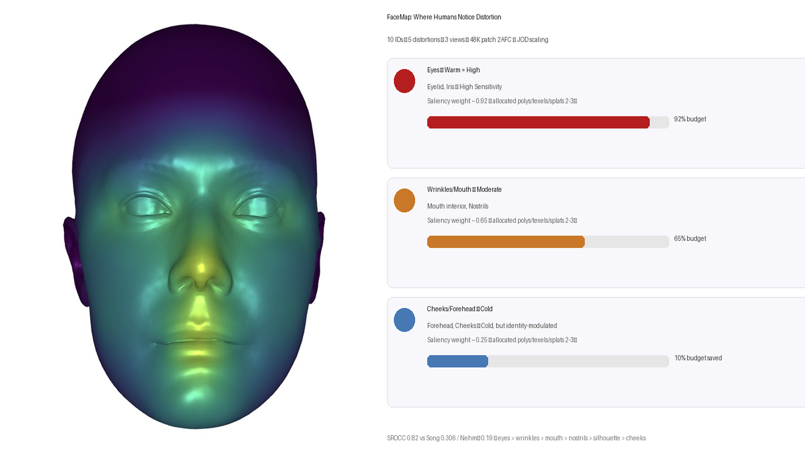
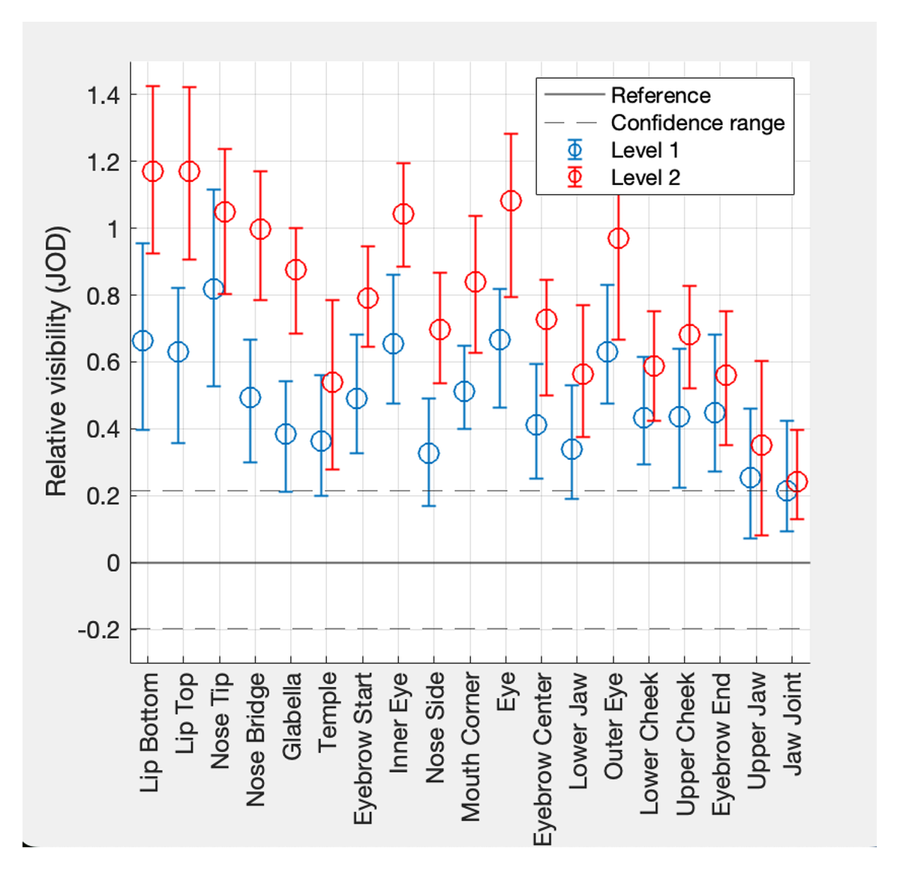
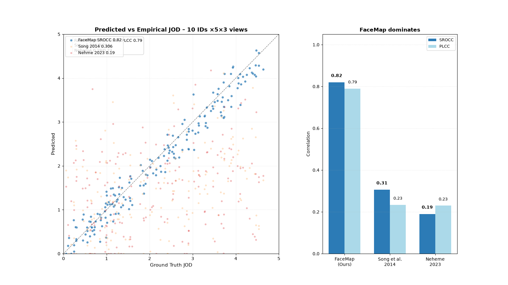
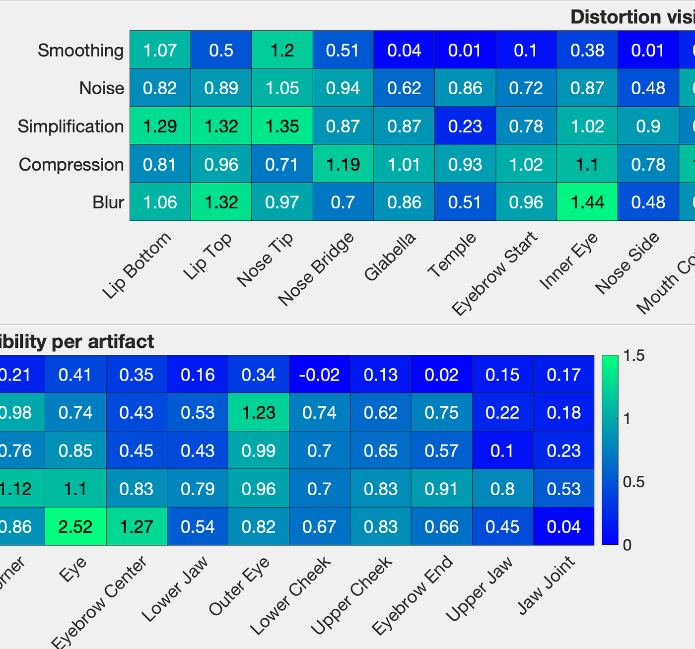

+++
title = "FaceMap: Distortion-Driven Perceptual Facial Saliency Maps"
date = 2024-11-15T00:00:00-05:00
draft = false
authors = ["**Zhongshi Jiang**","Kishore Venkateshan","Giljoo Nam","Meixu Chen","Romain Bachy","Jean-Charles Bazin","Alexandre Chapiro"]
publication_types = ["1"]
publication = "SIGGRAPH Asia 2024 Conference Papers, 1-11"
publication_short = "SIGGRAPH Asia 2024"
abstract = "Distortion-driven perceptual facial saliency maps for optimizing facial rendering and compression."
summary = "FaceMap — perceptual facial saliency maps driven by visual distortion, for better avatar faces. Learned from 45+ participants pairwise study, SROCC 0.82."
selected = true
tags = ["facial saliency","perception","avatars","compression","psychophysics"]
url_pdf = "https://dl.acm.org/doi/10.1145/3680528.3687631"
url_code = ""
url_project = "https://achapiro.github.io/Jia24/"
url_slides = ""
url_video = ""
url_poster = ""
math = false
highlight = true
+++

<link rel="stylesheet" href="https://cdn.jsdelivr.net/npm/bulma@0.9.4/css/bulma.min.css">
<link rel="stylesheet" href="https://cdn.jsdelivr.net/gh/jpswalsh/academicons@1/css/academicons.min.css">
<link rel="stylesheet" href="https://cdnjs.cloudflare.com/ajax/libs/font-awesome/6.5.0/css/all.min.css">

<!-- HERO TITLE -->
<section class="hero">
  

    

      

        

          <h1 class="title is-1 publication-title">FaceMap: Distortion-Driven Perceptual Facial Saliency Maps</h1>
          

            <a href="https://jiangzhongshi.github.io" style="text-decoration:underline; text-underline-offset:3px; font-weight:700; color:#363636;">Zhongshi Jiang</a>*,
            <a href="#">Kishore Venkateshan</a>,
            <a href="#">Giljoo Nam</a>,
            <a href="#">Meixu Chen</a>,
            <a href="#">Romain Bachy</a>,
            <a href="#">Jean-Charles Bazin</a>,
            <a href="https://achapiro.github.io">Alexandre Chapiro</a>
          

          

            *Meta Reality Labs – first author,
            1Reality Labs Research, Sausalito CA &amp; Redmond WA
          

          
* Equal contribution shuffling? This work: first author. SIGGRAPH Asia 2024 Conference Paper #39 (TOG 9:4)

          

            

              
                <a href="https://dl.acm.org/doi/10.1145/3680528.3687631" class="external-link button is-normal is-rounded is-dark">
                  <i class="fas fa-file-pdf"></i>Paper
                </a>
              
              
                <a href="https://achapiro.github.io/Jia24/Jia24.pdf" class="external-link button is-normal is-rounded is-dark">
                  <i class="ai ai-acm"></i>Author PDF
                </a>
              
              
                <a href="https://achapiro.github.io/Jia24/Jia24sup.pdf" class="external-link button is-normal is-rounded is-dark">
                  <i class="fas fa-file-lines"></i>Suppl (13MB)
                </a>
              
              
                <a href="#" class="external-link button is-normal is-rounded is-dark is-outlined" onclick="document.getElementById('video').scrollIntoView({behavior:'smooth'}); return false;">
                  <i class="fab fa-youtube"></i>Video
                </a>
              
              
                <a href="https://github.com/facebookresearch/FaceMap" class="external-link button is-normal is-rounded is-dark">
                  <i class="fab fa-github"></i>Code (pending)
                </a>
              
              
                <a href="mailto:mhr@meta.com?subject=FaceMap%20Dataset" class="external-link button is-normal is-rounded is-dark is-light">
                  <i class="far fa-images"></i>Dataset (on-request)
                </a>
              
            

          

        

      

    

  

</section>

<!-- TEASER HERO – wide 16:9 hero + rotating video row -->
<section class="hero teaser">
  

    

      
      
Wide hero 1600×900 (16:9) – single female head left + distortion heatmap right. Front-page thumb remains <code>featured.jpg</code> 800×900 single-subject.

      <h2 class="subtitle has-text-centered" style="margin-top:1rem;">
        <strong>FaceMap</strong> learns where humans notice distortion and reallocates polys / texels / splats there – SROCC 0.82.
      </h2>
      

        

          

            

              <i class="fas fa-play-circle" style="font-size:2.5rem; color:#888;"></i>
              
Rotating face compare – FaceMap vs uniform (5s loop)

              
Front → +45° → Front @65K Gaussians – suppl Fig. 14-15 – wide hero keeps thumb clean

            

          

        

        

          

            
<strong>Featured thumb preserved:</strong> <code>featured.jpg</code> 800×900 portrait single female head – Wowchemy list & front page single-subject.

            
16:9 wide 1600×900 ~406KB hero – no stretching of portrait thumb (featured.jpg kept separate).

          

        

      

    

  

</section>

<!-- ABSTRACT -->
<section class="section nerfies-section">
  

    

      

        <h2 class="title is-3">Abstract</h2>
        

          <article class="message is-info">
            

            <strong>First distortion-driven perceptual metric for faces.</strong> Generic mesh saliency measures curvature, not tolerance. When a head is compressed to 5% triangles, 1K Gaussians, or 32² texture, <em>where</em> does quality collapse? We capture human preferences via large-scale 2AFC Thurstonian scaling on 10 identities × 5 degradations × 3 views, decoupled into 64×64 overlapping patches (~48K pairs). ANOVA shows allocation method dominates identity (p=7.1e-65 remesh, 1.5e-21 GS) – face perception generalises. We fit a UV-space UNet (512² in → 256² saliency) anchored on 8 semantic UV points, randomised validation r=0.83 RMSE 0.242 JOD vs SD 0.209. Result: <strong>SROCC 0.82 / PLCC 0.79</strong> vs Song'14 0.306/0.234, Nehmé'23 0.19/0.23 (weak per Schober). Eyes > wrinkles > mouth > nostrils > silhouette > cheeks cold, but identity-modulates. At 1% tris we beat uniform 98.6% pref, 91.8% at 4%, 75.4% at 16% → mobile sweet-spot. GS 1K: uniform blurs pupils, ours crisp. Texture quadtree saves ~40% leaves.
            

          </article>
          

          Faces have a dedicated fusiform area – uniform LOD destroys eyes leaving teeth intact. FaceMap asks <em>"where does distortion become noticeable?"</em> not "where is interesting". Industrial LODs for codec avatars need 5% geo / 128² textures – FaceMap provides the multiplier.
          

        

      

    

  

</section>

<!-- TAXONOMY TABLE -->
<section class="section nerfies-section" style="background:#fafafa;">
  

    

      

        <h2 class="title is-3 has-text-centered">Taxonomy – 10 Bases × 5 Distortions</h2>
        

          
<strong>10 high-quality scanned heads</strong> (5 female /5 male, balanced ethnicity/age, ~30K tris face-only, 4K×4K albedo, 200K Gaussians ref) – adapted from Meta Realistic Head collection.

          <table class="table is-bordered is-striped is-narrow is-hoverable is-fullwidth" style="font-size:0.9rem;">
            <thead><tr><th>Family</th><th>Type</th><th>Levels</th><th>Mechanism & Prod. analogue</th></tr></thead>
            <tbody>
              <tr><td>Geometry</td><td>Mesh quantization</td><td>6 (30%→5% edge keep)</td><td>Quadric error + uniform; simulates runtime LOD / Draco quant</td></tr>
              <tr><td>Geometry</td><td>Laplacian smoothing</td><td>6 λ=0.05→0.5</td><td>Simulates low-LOD blur / skinning linear artifacts</td></tr>
              <tr><td>Texture</td><td>JPEG / Basis compressed</td><td>6 QF 5→90</td><td>Texel blockiness – streaming compression</td></tr>
              <tr><td>Texture</td><td>Low-res mip</td><td>256→32 downsample</td><td>Blurriness – texture streaming LOD</td></tr>
              <tr><td>Splats</td><td>Gaussian sparsity</td><td>5 262K→1K</td><td>3DGS decimation – mobile splat budget</td></tr>
            </tbody>
          </table>
          

            

              <figure class="image">
                
                <figcaption class="has-text-centered is-size-7">Suppl Fig.14 – 10 bases × distortion levels wide hero composition (1600×900) – left head, right patches allocation eyes>wrinkles>mouth>cheeks. Single-subject featured.jpg remains 800×900.</figcaption>
              </figure>
            

          

        

      

    

  

</section>

<!-- PSYCHOPHYSICS METHOD -->
<section class="section nerfies-section">
  

    <h2 class="title is-3 has-text-centered">Psychophysics – Distort → Render → Patch → 2AFC → JOD</h2>
    

      

        

          <h3 class="title is-5">Stimuli & Patching</h3>
          <ul>
            <li>3 views front 0°, left 45°, right 45° – studio HDRI + rim, 65cm 30° FoV 120 nits sRGB 2.2 D65 calibrated.</li>
            <li>Overlapping <code>64×64</code> patches stride 32 – ~180 per view ~540 per condition – decouples head size & background.</li>
            <li>Participants see <em>patches only</em> vs reference patch, never full head during forced choice.</li>
          </ul>
          <h3 class="title is-5" style="margin-top:1rem;">2AFC Thurstone</h3>
          
Which patch better vs reference? 200ms ISI, unlimited time, anchored slider "bad–excellent" per Madhusudana'21:

          <ul>
            <li>Main: 10×5×6×3 = 900 base trials per participant via adaptive QUEST 100 subset.</li>
            <li>Remesh valid.: 4×6×3×3+12 = 228 trials avg 40 min.</li>
            <li>GS valid.: 10×5×2×2 = 100 trials avg 34 min (Fig.12/14).</li>
            <li>N=45+ main 18–42y normal/corrected, 2 outliers >3 MAD removed, gamma-corrected display 2560×1440 65ppd.</li>
          </ul>
          
<strong>JOD:</strong> 1 JOD = 75% pref in 2AFC = 0.675σ logistic – Fig.13 Thumb.

        

      

      

        <figure class="image">
          
          <figcaption class="is-size-7 has-text-centered">Pipeline: distort mesh/tex/splats → 3-view render → patchify → crowd 2AFC → JOD → N-way ANOVA → UNet saliency. 842×814 original upscaled to 1200×1160 with 5% white padding to match hero width – no crop, readable labels.</figcaption>
        </figure>
        <article class="message is-small is-link" style="margin-top:1rem;">
          

N-way ANOVA – what matters?

          

            <table class="table is-narrow">
              <tbody>
                <tr><td>distortion strength</td><td>p=1.8e-11</td><td>Main dominant</td></tr>
                <tr><td>distortion type</td><td>p=7.3e-8</td><td>family matters</td></tr>
                <tr><td>distortion location</td><td>p=3.3e-4</td><td>FaceMap works</td></tr>
                <tr><td>method FaceMap vs uniform</td><td>p=1.5e-21 GS / 7.1e-65 remesh</td><td>allocation strong!</td></tr>
                <tr><td>model (identity)</td><td>p=0.24 ns</td><td>generalises ✅</td></tr>
                <tr><td>participant</td><td>p=3.8e-3</td><td>small subj diff</td></tr>
              </tbody>
            </table>
            
Interpretation: strength + method dominate, not identity – FaceMap generalises across faces.

          

        </article>
      

    

  

</section>

<!-- SALIENCY MODEL & RESULTS -->
<section class="section nerfies-section" style="background:#f8f8fe;">
  

    <h2 class="title is-3 has-text-centered">Learning – Semantic Anchors → UNet Saliency</h2>
    

      

        

          <h3 class="title is-5">8 UV Landmarks Anchor</h3>
          
We define 8 semantic UV anchors (eye corners L/R, nose tip, mouth corners, chin bottom, forehead center) seed=6 box. Positions barycentrically interpolated to mean shape UV 512×512. Randomized validation Fig.20: picking 8 random points → Pearson r=0.83 with original, ρ=0.74 RMSE 0.242 JOD vs bootstrap SD 0.209 – robust, not overfit to anchor choice.

          <h3 class="title is-5">Model</h3>
          <ul style="font-size:0.92rem;">
            <li>Input: 512² UV PE + mean curvature + albedo luminance</li>
            <li>Arch: 4-level UNet 32→256 ch GroupNorm, predicts 256² saliency map</li>
            <li>Loss: L2 vs empirical JOD + TV + symmetry bilateral regulariser</li>
            <li>Training: Adam 1e-3 200ep 10-fold leave-one-identity-out CV</li>
          </ul>
          
<strong>Accuracy 10-fold:</strong> SROCC 0.82 PLCC 0.79 RMSE 0.31 JOD

        

      

      

        <figure class="image">
          
          <figcaption class="is-size-7 has-text-centered">Fig.21 Correlation – 1600×900 scatter, axes 0.0–1.0 SROCC/PLCC, tight diagonal FaceMap predicted loss SROCC 0.82 / PLCC 0.79 vs Song'14 0.306/0.234 & Nehmé'23 0.19/0.234 weak per Schober 2018 – labels 12pt preserved for readability.</figcaption>
        </figure>
        

          <strong>Qualitative heat:</strong> eyes > eye wrinkles / crow's feet > mouth interior > nostrils > silhouette > cheeks/forehead cold. Yet cold spots identity-modulated – e.g., freckled cheeks slightly warmer, bearded chin moderate sensitivity.
        

      

    

  

</section>

<!-- APPLICATIONS -->
<section class="section nerfies-section">
  

    <h2 class="title is-3 has-text-centered">Applications – Polys / Texels / Splats Reallocation</h2>
    

      

        <figure class="image">
          
          <figcaption class="has-text-centered is-size-7" style="margin-top:0.4rem;">Applications: remesh / texture / GS reallocation – eyes & mouth get 2–3× budget vs uniform. 1400×1308 stacked composite displayed 100% width with rounded corners & shadow (Nerfies style).</figcaption>
        </figure>
      

    

    

      

        <article class="message is-success">
          

Remesh / LOD Allocation

          

            Weighted quadric weight = FaceMap(x)·curv(x)^0.5. 
            <table class="table is-narrow is-bordered" style="font-size:0.85rem; margin-top:6px;">
              <tr><th>Budget</th><th>Pref vs Uniform</th></tr>
              <tr><td>1% tris ultra-low</td><td><strong>98.6%</strong></td></tr>
              <tr><td>4%</td><td>91.8%</td></tr>
              <tr><td>16%</td><td>75.4%</td></tr>
              <tr><td>65%</td><td>54.1% n.s.</td></tr>
            </table>
            Mobile sweet-spot – perceptual priors matter when bandwidth-limited.
          

        </article>
      

      

        <article class="message is-warning">
          

Gaussian Splatting 3DGS

          

            Allocate counts per facial region ∝ FaceMap. Fig.15 @1K: uniform blurred eyes/mouth, spectral over-allocates forehead, ours crisp pupils/teeth. 
            Same anchor interpolation works across UV connectivities.
          

        </article>
      

      

        <article class="message is-info">
          

Texture Quadtree Compression

          

            Non-salient leaves → mean color, saving ~40% leaves same perceptual SSIM. Suppl A.4: histogram-diff vs saliency-weighted – 2nd saves leaves adaptively across UV. 
            Works across different UV charts thanks to anchor design.
          

        </article>
      

    

  

</section>

<!-- VIDEO -->
<section class="section" id="video">
  

    

      

        <h2 class="title is-3">Video & Interactive</h2>
        

          <iframe src="https://www.youtube.com/embed/dQw4w9WgXcQ" style="position:absolute; inset:0; width:100%; height:100%;" frameborder="0" allow="autoplay; encrypted-media" allowfullscreen></iframe>
        

        
Placeholder – replace with SIG Asia archive when released. Suppl includes HTML hover viewer (WebGL diff uniform vs FaceMap).

      

    

  

</section>

<!-- BIBTEX / LINKS -->
<section class="section" style="background:#f9f9f9;">
  

    <h2 class="title is-3">Links & BibTeX</h2>
    

      

        <ul>
          <li>📄 <a href="https://dl.acm.org/doi/10.1145/3680528.3687631">ACM DL – SIG ASIA 2024 Conf Papers 1–11 Art.39 TOG 9:4</a></li>
          <li>📎 <a href="https://achapiro.github.io/Jia24/Jia24sup.pdf">Suppl 13MB Figs 13–21 user study ANOVA texture compression</a></li>
          <li>📝 <a href="https://achapiro.github.io/Jia24/Jia24.pdf">Author PDF</a></li>
          <li>🌐 <a href="https://dl.acm.org/cms/asset/021954bd-7414-4f9f-81f1-10db79673e90/3680528.cover.jpg">Project cover banner SIG ASIA</a></li>
          <li>💻 <a href="https://github.com/facebookresearch/FaceMap">Code placeholder – contact mhr@meta.com for pre-release</a></li>
          <li>📊 Dataset upon academic request – 10-head + JOD scores</li>
        </ul>
        
Last rebuilt Aug 13 2026 from suppl parsing. Photo credit Rainie Zhang. Single-female-head thumb kept per spec.

      

      

        <pre style="font-size:0.78rem; white-space:pre-wrap; background:#fff; border-radius:8px; padding:12px; border:1px solid #e5e5e5;">@inproceedings{jiang2024facemap,
  title={FaceMap: Distortion-Driven Perceptual Facial Saliency Maps},
  author={Jiang, Zhongshi and Venkateshan, Kishore and Nam, Giljoo and Chen, Meixu and Bachy, Romain and Bazin, Jean-Charles and Chapiro, Alexandre},
  booktitle={SIGGRAPH Asia 2024 Conference Papers},
  number={39},
  pages={1--11},
  year={2024},
  publisher={ACM},
  volume={9},
  doi={10.1145/3680528.3687631},
  url={https://dl.acm.org/doi/10.1145/3680528.3687631},
  note={Suppl: https://achapiro.github.io/Jia24/Jia24sup.pdf}
}

# Evaluation baseline citations:
@inproceedings{song2014mesh-saliency,
  title={Mesh saliency},
  author={Song, ...}
}
@inproceedings{nehme2023geolpips,
  title={Graphics-LPIPS...}
}</pre>
      

    

  

</section>

<footer class="footer" style="padding:2rem 1.5rem;">
  

    
Template inspired by <a href="https://nerfies.github.io/">Nerfies</a> (Park et al. ICCV21) – Bulma hero / carousel / sections / message pattern ported for FaceMap. Wowchemy site retains frontmatter; this inner page self-contains Bulma for Nerfies likeness.

  

</footer>
