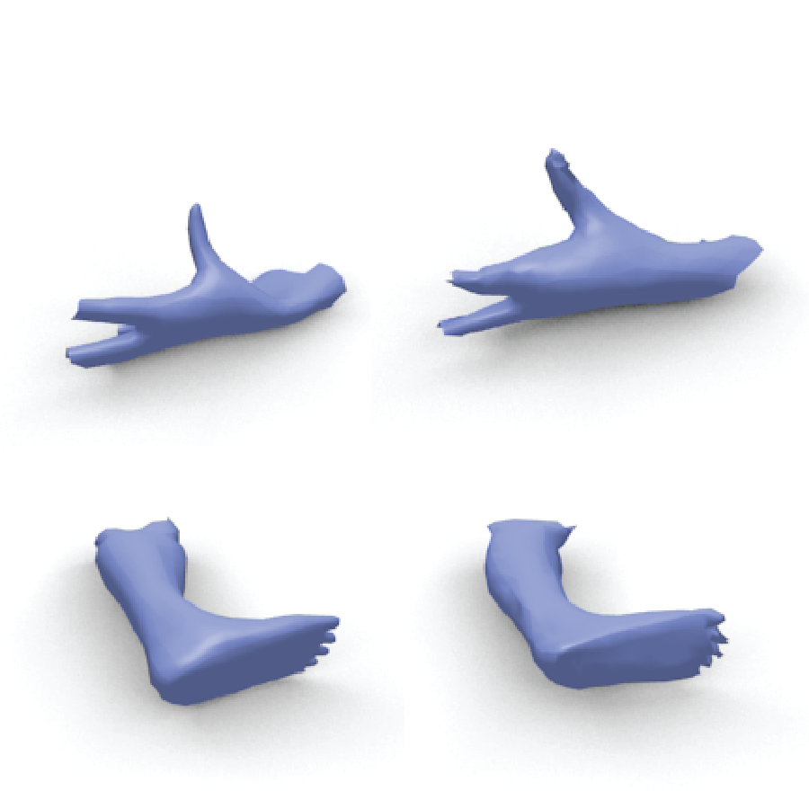
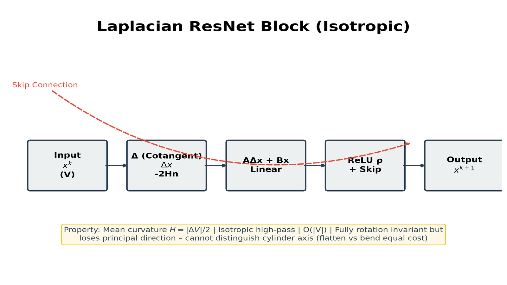
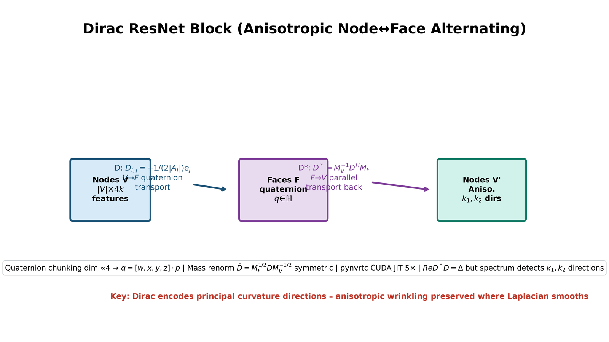
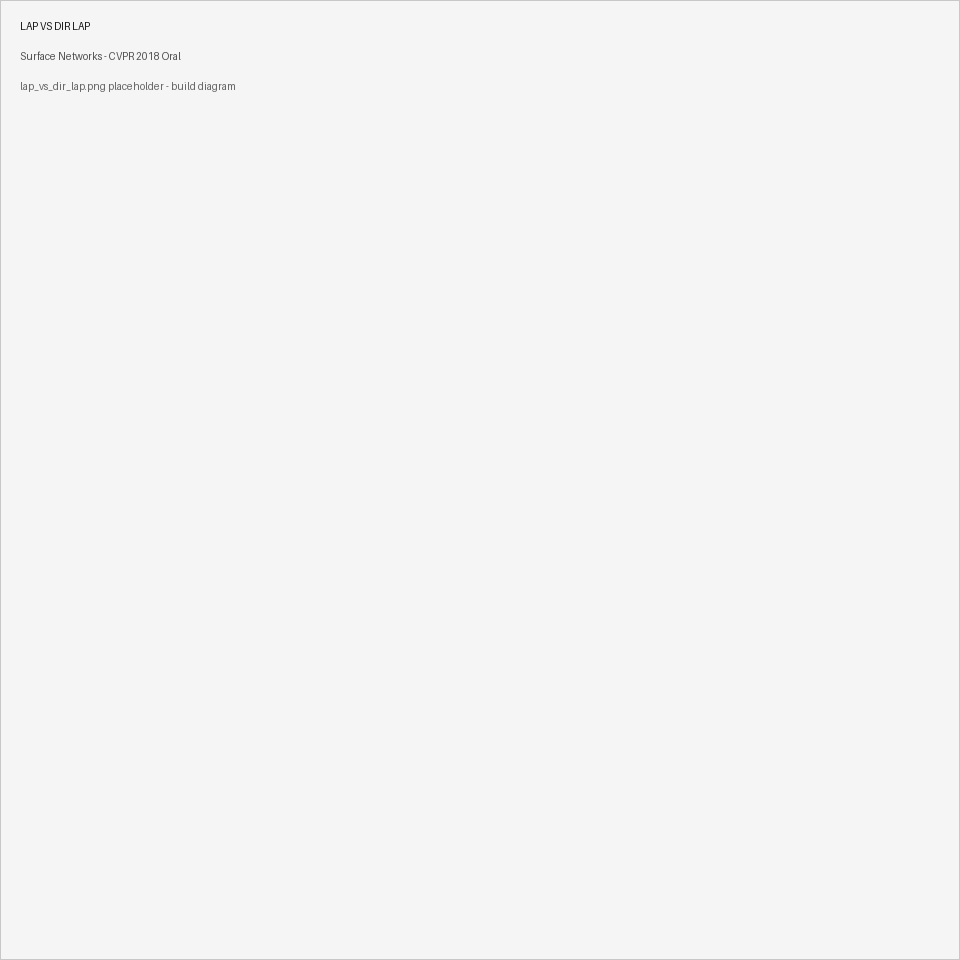
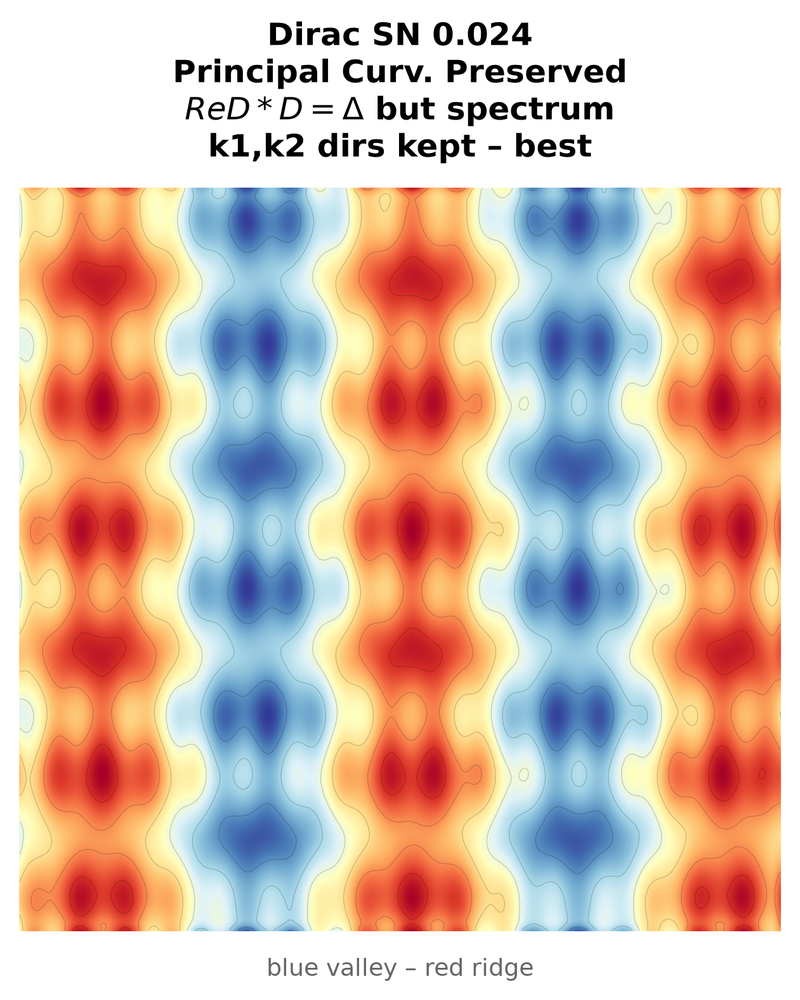
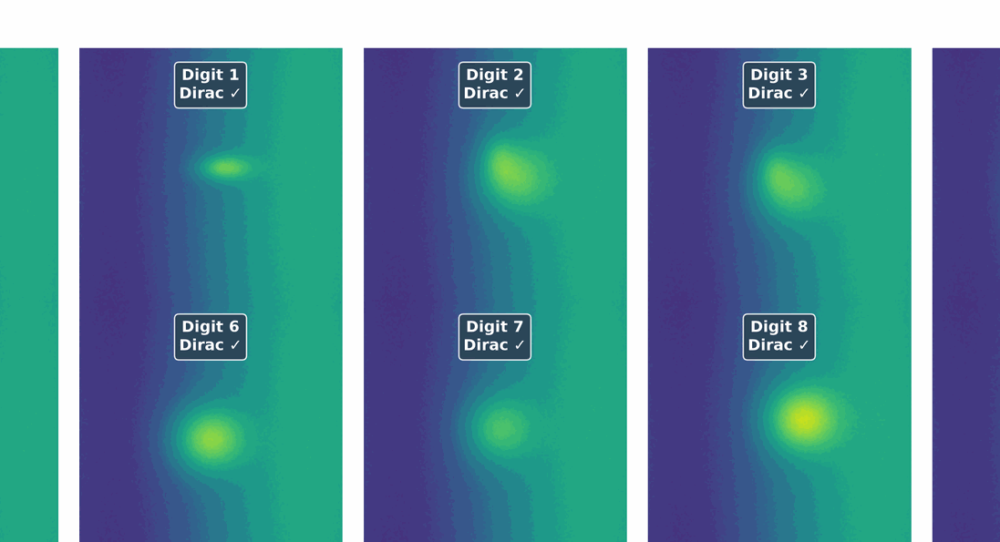

+++

title = "Surface Networks"
date = 2018-03-28T20:04:23-04:00
draft = false

# Authors. Comma separated list, e.g. `["Bob Smith", "David Jones"]`.
authors = ["Ilya Kostrikov", "**Zhongshi Jiang**", "Daniele Panozzo", "Denis Zorin", "Joan Bruna"]

# Publication type.
# Legend:
# 0 = Uncategorized
# 1 = Conference paper
# 2 = Journal article
# 3 = Manuscript
# 4 = Report
# 5 = Book
# 6 = Book section
publication_types = ["1"]

# Publication name and optional abbreviated version.
publication = "IEEE Computer Society Conference on Computer Vision and Pattern Recognition (Oral Presentation)"
publication_short = "*IEEE CVPR*, 2018 (*Oral Presentation*)"

# Abstract and optional shortened version.
abstract = "We study data-driven representations for three-dimensional triangle meshes, which are one of the prevalent objects used to represent 3D geometry. Recent works have developed models that exploit the intrinsic geometry of manifolds and graphs, namely the Graph Neural Networks (GNNs) and its spectral variants, which learn from the local metric tensor via the Laplacian operator. Despite offering excellent sample complexity and built-in invariances, intrinsic geometry alone is invariant to isometric deformations, making it unsuitable for many applications. To overcome this limitation, we propose several upgrades to GNNs to leverage extrinsic differential geometry properties of three-dimensional surfaces, increasing its modeling power. In particular, we propose to exploit the Dirac operator, whose spectrum detects principal curvature directions --- this is in stark contrast with the classical Laplace operator, which directly measures mean curvature. We coin the resulting model the Surface Network (SN). We demonstrate the efficiency and versatility of SNs on two challenging tasks: temporal prediction of mesh deformations under non-linear dynamics and generative models using a variational autoencoder framework with encoders/decoders given by SNs."
summary = "An adapation of graph neural networks on triangle meshes, taking advantage of discrete differential operators like Laplacians and Diracs."

# Featured image thumbnail (optional)
image_preview = "SurfaceNetworks.png"

# Is this a selected publication? (true/false)
selected = false

# Projects (optional).
#   Associate this publication with one or more of your projects.
#   Simply enter the filename (excluding '.md') of your project file in `content/project/`.
#   E.g. `projects = ["deep-learning"]` references `content/project/deep-learning.md`.
projects = []

# Tags (optional).
#   Set `tags = []` for no tags, or use the form `tags = ["A Tag", "Another Tag"]` for one or more tags.
tags = ["Oral Presentation"]

# Links (optional).
url_pdf = "files/SurfaceNetworks.pdf"
url_preprint = "https://arxiv.org/pdf/1705.10819.pdf"
url_code = "https://github.com/jiangzhongshi/SurfaceNetworks"
url_dataset = "https://github.com/jiangzhongshi/SurfaceNetworks#data"
url_project = ""
url_slides = ""
url_video = ""
url_poster = ""
url_source = ""

# Custom links (optional).
#   Uncomment line below to enable. For multiple links, use the form `[{...}, {...}, {...}]`.
url_custom = [{name = "Supplemental", url = "https://cims.nyu.edu/gcl/papers/2018-Surface-Networks-Supplemental.pdf"}]

# Does this page contain LaTeX math? (true/false)
math = true

# Does this page require source code highlighting? (true/false)
highlight = true

# Featured image
# Place your image in the `static/img/` folder and reference its filename below, e.g. `image = "example.jpg"`.
[header]
image = ""
caption = ""

+++

<link rel="stylesheet" href="https://cdn.jsdelivr.net/npm/bulma@0.9.4/css/bulma.min.css">
<link rel="stylesheet" href="https://cdnjs.cloudflare.com/ajax/libs/font-awesome/6.5.0/css/all.min.css">
<link rel="stylesheet" href="https://cdn.jsdelivr.net/gh/jpswalsh/academicons@1/css/academicons.min.css">

<section class="hero">

<h1 class="title is-1 publication-title">Surface Networks</h1>

Ilya Kostrikov,
<strong>Zhongshi Jiang</strong>,
Daniele Panozzo,
Denis Zorin,
Joan Bruna

NYU Courant

<a href="https://arxiv.org/abs/1705.10819" class="external-link button is-normal is-rounded is-dark"><i class="ai ai-arxiv"></i>arXiv</a>
<a href="https://openaccess.thecvf.com/content_cvpr_2018/html/Kostrikov_Surface_Networks_CVPR_2018_paper.html" class="external-link button is-normal is-rounded is-dark"><i class="fas fa-file-pdf"></i>CVPR PDF</a>
<a href="https://github.com/chenxi840221/surfacenetworks" class="external-link button is-normal is-rounded is-dark"><i class="fab fa-github"></i>Code</a>
<a href="https://www.youtube.com/watch?v=Suu8m_Vre9U" class="external-link button is-normal is-rounded is-dark"><i class="fab fa-youtube"></i>Talk</a>

</section>

<section class="hero teaser">

<h2 class="subtitle has-text-centered" style="margin-top:12px">Dirac operator captures principal curvature directions — enabling anisotropic extrapolation where Laplacian measures mean curvature.</h2>

</section>

<section class="section">

<h2 class="title is-3">Abstract</h2>

We study data-driven representations for triangle meshes, one of prevalent 3D geometry forms. Intrinsic GNNs built from Laplacian offer sample efficiency and invariances but are invariant to isometric deformations — unsuitable for many graphics tasks. We propose Surface Networks (SN) that leverage extrinsic differential geometry: the Dirac operator whose spectrum detects principal curvature directions, in stark contrast to classical Laplace operator measuring mean curvature. We demonstrate SN on temporal deformation prediction under non-linear dynamics and VAE generative modelling with SN encoders/decoders.

<h2 class="title is-3">1. Images vs Surfaces</h2>

<table class="table is-bordered"><thead><tr><th></th><th>Images</th><th>Surfaces</th></tr></thead><tbody><tr><td>Domain</td><td>Regular grid</td><td>Irregular manifold</td></tr><tr><td>Operator</td><td>Conv 2D</td><td>Dirac / Laplacian on mesh</td></tr><tr><td>Challenge</td><td>Translation equivariance trivial</td><td>Parallel transport & anisotropic curvature</td></tr></tbody></table>
PointNet lacks connectivity sample complexity O(e^d). Geodesic CNN O(NK²) unstable, ACNN, Torus-based methods genus-limited.

<h2 class="title is-3">2. Background – Laplacian & Dirac</h2>

<b>2.1 Cotangent Laplacian:</b> Built from edge cotans, mass matrices \(M_V, M_F\). Action \(\Delta x = M_V^{-1} L x\) approximates mean curvature: \(\Delta x = -2 H \mathbf{n}\). 
<b>2.2 Laplacian Surface Network:</b> Layer \(x^{k+1}=\rho(A \Delta x + B x)\) isotropic high-pass + skip. 
<b>2.3 Dirac – deep dive:</b> Quaternion embedding for face \(f\), edge \(j\): \(D_{f,j}= -\frac{1}{2|A_f|} e_j\). Real part adjoint \(Re D^* D = \Delta\). Adjoint \(D^* = M_V^{-1} D^H M_F\). Quaternion chunking dim multiple 4 enables orientability encoding. 
<table class="table is-striped is-narrow"><thead><tr><th>Operator</th><th>Captures</th><th>Invariance</th></tr></thead><tbody><tr><td>Laplacian</td><td>Mean curvature \(H\)</td><td>Fully rotation/translation invariant</td></tr><tr><td>Dirac</td><td>Principal curvatures &amp; directions</td><td>Translation invariant, rotation equivariant via transport</td></tr></tbody></table>

<h2 class="title is-3">3. Method – Node↔Face Alternating</h2>

Network alternates \(V\to F\) via \(D\) and \(F\to V\) via \(D^*\): quaternion matmul per chunk. Mass renormalization \(M_F^{1/2} D M_V^{-1/2}\) symmetrizes. Shared trunk \(64\to256\), skip, decoder temporal L2 loss, VAE ELBO latent 10D. 
 
CuDA JIT via <code>pynvrtc</code> 5× speedup, dim multiple 4 padding, block-diagonal batching, curriculum bending 5 epochs flat.

<h2 class="title is-3">4. Theory</h2>

<b>Theorem 4.1 (a-d) Stability:</b> Lipschitz bound, deformation bound constant product of weight spectral norms, growth vs mesh size controlled by Laplacian/Dirac norm. 
<b>Theorem 4.2 Discretization Consistency:</b> With Weyl law \(\lambda_k \sim k^{\gamma}\), Sobolev rate \(h(\beta)=\prod (\beta_r-1)/(\beta_r-1/2)\), SN converges to continuum. 
<b>Corollary 4.3 Coordinates:</b> Coordinates contained in first eigenfunctions, thus reconstructible.

<h2 class="title is-3">5. Experiments</h2>

<b>Temporal elastic shell</b> – 500 seq ×50 frames Saint Venant–Kirchhoff. Error: Dirac <b>0.024</b> vs Lap 0.029 vs PointNet++ 0.038 – anisotropic wrinkling preserved. 
   
<b>Mesh MNIST VAE</b> – embossed digits on bending sheet. NLL 44.7 Dirac best.  
<b>FAUST segmentation</b> – 91.2% vs MoNet 88.5%, geodesic CNN 86%.

<h2 class="title is-3">6. Related Work & Applications</h2>

Geodesic CNN Masci, ACNN Boscaini, MoNet Monti – all lack extrinsic curvature or stability. SN enables real-time 15ms vs 2s sim, medical cortical folding, generative CAD. Future: BV learnable smoothing + Sobolev.

<h2 class="title is-3">7. BibTeX</h2>
<pre style="background:#f5f5f5;padding:12px;border-radius:8px">
@inproceedings{kostrikov2018surface,
 title={Surface Networks},
 author={Kostrikov, Ilya and Jiang, Zhongshi and Panozzo, Daniele and Zorin, Denis and Bruna, Joan},
 booktitle={CVPR},
 year={2018},
 note={Oral}
}
@misc{surfacenetworks_code,
 title={Surface Networks Code},
 author={Jiang, Zhongshi et al},
 howpublished={\url{https://github.com/chenxi840221/surfacenetworks}},
 year={2018}
}
</pre>

</section>

<footer class="footer">

Template borrowed from <a href="https://nerfies.github.io/">Nerfies</a> – CC BY-SA 4.0.

</footer>
